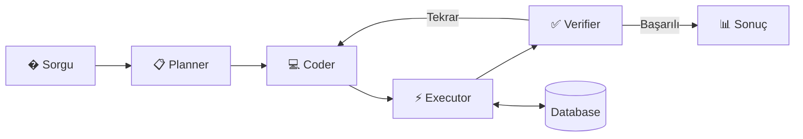

# Veritabanı Sorgu Sistemi

🇹🇷 Türkçe | [🇬🇧 English](README_EN.md)

LLM tabanlı ajanlar kullanarak doğal dil ile veritabanı sorgulama sistemi. Kullanıcı Türkçe veya İngilizce bir soru sorar, sistem bunu SQL'e çevirip çalıştırır.



## 🏗️ Mimari

| Ajan | Görev |
|------|-------|
| **Explorer** | Veritabanı şemasını keşfeder ve özetler |
| **Planner** | Kullanıcı isteğine göre sorgu planı oluşturur |
| **Coder** | Plana göre SQL sorgusu üretir |
| **Verifier** | Sonuçları değerlendirir, yetersizse tekrar dener |

## ⚙️ Kurulum

### 1. Gereksinimleri Yükle
```bash
pip install -r requirements.txt
```

### 2. API Anahtarını Ayarla

**Seçenek A: Ortam Değişkeni (Önerilen)**
```bash
# Windows PowerShell
$env:OPENROUTER_API_KEY = "your-api-key"

# Linux/Mac
export OPENROUTER_API_KEY="your-api-key"
```

**Seçenek B: Config Dosyası**
```bash
cp config.example.json config.json
# config.json içinde api_key alanını düzenleyin
```

### 3. Veritabanını Yapılandır

`config.json` içinde veritabanı ayarlarını yapın:
```json
{
    "type": "sqlite",
    "database": "example.db"
}
```

## 🚀 Çalıştırma

```bash
python main.py
```

## 🔒 Güvenlik

- **Read-Only**: Sistem varsayılan olarak sadece SELECT sorgularını çalıştırır
- **API Key**: Ortam değişkeninden okunur, repo'ya dahil değildir

> **Not:** Yazma işlemlerini (INSERT, UPDATE, DELETE) aktif etmek için `src/database.py` dosyasındaki `execute_query` fonksiyonunu düzenleyebilirsiniz. Bu durumda whitelist, kullanıcı onayı veya audit log gibi ek güvenlik önlemleri almanız önerilir.

## 📋 Desteklenen Modeller

Varsayılan: `mistralai/devstral-2512:free` (OpenRouter üzerinden)

OpenAI uyumlu herhangi bir API kullanılabilir (`base_url` değiştirerek).

## 📄 Lisans

MIT