# Database Query System

[🇹🇷 Türkçe](README.md) | 🇬🇧 English

An LLM-based agent system for querying databases using natural language. Users can ask questions in natural language, and the system converts them to SQL and executes them.

```mermaid
flowchart LR
    A[👤 Query] --> B[📋 Planner] --> C[💻 Coder] --> D[⚡ Executor] --> E[✅ Verifier]
    E -->|Success| F[📊 Result]
    E -->|Retry| C
    D <--> G[(Database)]
```



## 🏗️ Architecture

| Agent | Role |
|-------|------|
| **Explorer** | Discovers and summarizes database schema |
| **Planner** | Creates query plan based on user request |
| **Coder** | Generates SQL query from the plan |
| **Verifier** | Validates results, retries if insufficient |

## ⚙️ Setup

### 1. Install Dependencies
```bash
pip install -r requirements.txt
```

### 2. Set API Key

**Option A: Environment Variable (Recommended)**
```bash
# Windows PowerShell
$env:OPENROUTER_API_KEY = "your-api-key"

# Linux/Mac
export OPENROUTER_API_KEY="your-api-key"
```

**Option B: Config File**
```bash
cp config.example.json config.json
# Edit the api_key field in config.json
```

### 3. Configure Database

Set database settings in `config.json`:
```json
{
    "type": "sqlite",
    "database": "example.db"
}
```

## 🚀 Usage

```bash
python main.py
```

## 🔒 Security

- **Read-Only**: System only executes SELECT queries by default
- **API Key**: Read from environment variable, not included in repo

> **Note:** To enable write operations (INSERT, UPDATE, DELETE), modify the `execute_query` function in `src/database.py`. In this case, implementing additional security measures like whitelisting, user confirmation, or audit logging is recommended.

## 📋 Supported Models

Default: `mistralai/devstral-2512:free` (via OpenRouter)

Any OpenAI-compatible API can be used (by changing `base_url`).

## 📄 License

MIT
